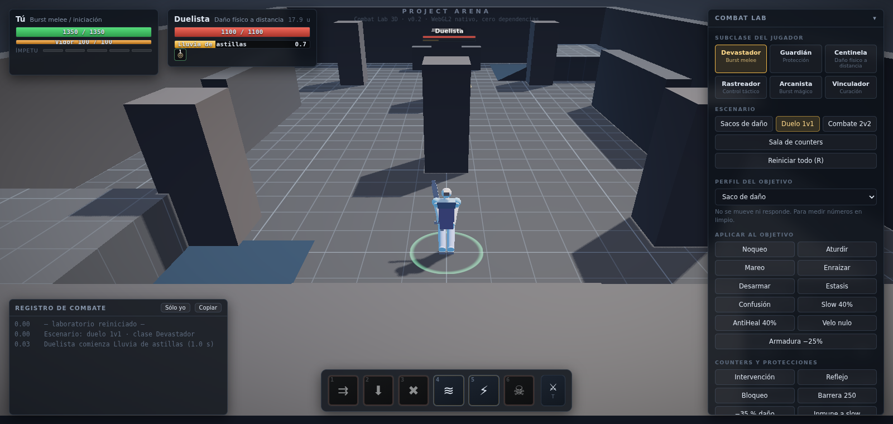

# Project Arena · Combat Lab 3D

Prototipo jugable del combate de un MMO PvP de fantasía en tercera persona.
**HTML, CSS, JavaScript y WebGL2 nativo. Cero dependencias.**

Sin npm, sin Node para jugar, sin Three.js, sin servidor: **doble clic en
`index.html`** y ya está.

> *"Si el combate es divertido en una sala gris con personajes genéricos, existe
> una base real sobre la cual construir el juego."*



---

## Empezar

| Quiero… | Abre |
|---|---|
| Jugar | `index.html` |
| Ver que las reglas se cumplen | `tests.html` |
| Verificar sin navegador | `node tools/run-tests.js` |
| Entender el código antes de tocarlo | [`ARCHITECTURE.md`](ARCHITECTURE.md) |

## Controles

| Acción | Tecla |
|---|---|
| Mover | `W` `A` `S` `D` (relativo a cámara) |
| Cámara | arrastrar con el ratón · rueda para zoom |
| Girar el personaje | arrastrar con el botón derecho |
| Seleccionar objetivo | clic · `Tab` enemigos · `⇧Tab` aliados |
| Seleccionarte a ti | `F` |
| Habilidades | `1` … `6` |
| Ataque normal | `T` |
| Cancelar casteo | `Esc` |
| Reiniciar escenario | `R` |

---

## Qué hay dentro

**Seis subclases**, cada una con 6 habilidades activas y 1 pasiva, y con un
papel que ninguna otra cubre igual:

| Subclase | Rol | Lo que sólo ella hace |
|---|---|---|
| **Devastador** | Burst melee / iniciación | Derribo, ruptura de armadura y purga en cuerpo a cuerpo |
| **Guardián** | Protección / peel | Bloqueo determinista, reflejo mágico y redirección de daño |
| **Centinela** | Daño físico a distancia | Alcance largo, penetración de armadura y estasis a distancia |
| **Rastreador** | Control táctico | Sigilo, trampas, antiheal y bloqueo de utility enemiga |
| **Arcanista** | Burst mágico / anti-soporte | Root, estasis y AntiBuff |
| **Vinculador** | Curación / counters | Barreras, cleanse, Intervención y enlace protector |

**Sistemas de combate implementados**

* Orden de resolución obligatorio: Estasis → Intervención → Reflejo → Bloqueo →
  mitigación → estados → cleanse/purga.
* Taxonomía completa de control: noqueo, aturdimiento, mareo, enraizar,
  desarmar, estasis, bloqueo de utility, slow, rotura de defensa, AntiHeal y
  AntiBuff, cada uno con sus reglas propias de apilado y disipación.
* Diminishing Returns por categoría, con interruptor para comparar el estándar
  moderno con la cadena de control larga del MMO clásico.
* GCD en tres tramos, cola de input de 200 ms, interrupción con bloqueo de
  escuela, y casteos que se cancelan al moverse.
* Línea de visión por raycast, rango medido en el plano, colisión contra muros y
  entre personajes, proyectiles que resuelven al impactar.

**Combat Lab**

Cuatro escenarios (sacos de daño, duelo 1v1, combate 2v2, sala de counters),
siete perfiles de dummy, aplicación directa de cada control y cada counter sobre
el objetivo, e interruptores para DR, RNG, cooldowns, coste de recurso, IA,
invulnerabilidad, telegraphs y cámara lenta.

Registro de combate con marca de tiempo de simulación y copia al portapapeles:
cualquier secuencia rara se puede reproducir y pegar en un informe.

---

## Verificación

```bash
node tools/run-tests.js     # 80 pruebas
node tools/browser.js smoke # arranca el juego real en Chromium headless
```

Las pruebas no comprueban sólo fórmulas. Los objetivos de ritmo del documento
—tiempo hasta la muerte, ventana de burst, cadenas de control, valor del
soporte— se verifican **simulando combates completos entre bots** y fallan si el
ritmo se sale de márgenes. Un ajuste de números que rompa el juego no pasa
inadvertido.

El runner headless lee el orden de carga del propio `tests.html`, así que no
puede divergir de lo que se ejecuta en el navegador.

---

## Estado y siguiente paso

Esto es la **fase 3–6 del roadmap** del documento de diseño: simulación,
renderer 3D, Combat Lab, las seis clases y bots. Deliberadamente **fuera de
alcance por ahora**: mundo abierto, quests, economía, progresión, loot y
monetización.

Los nombres, timings y valores son provisionales. La prioridad es validar un
game feel *"rápido en manos, táctico en cabeza"* antes de expandir el mundo.

Los pasos siguientes previstos son sustituir el humanoide procedural por mallas
reales, llevar la simulación validada a Unity para producción visual, y montar
un servidor autoritativo para 1v1/2v2/3v3 en línea.
